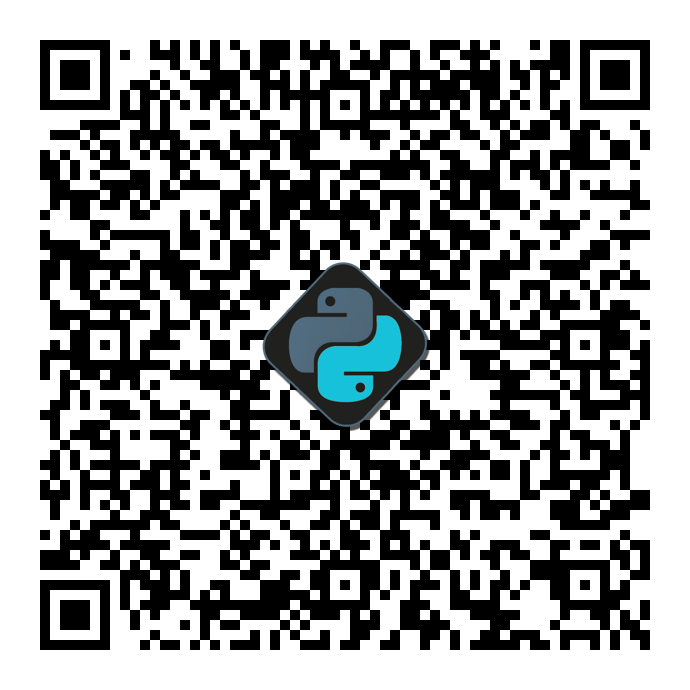

# Bem-vindo ao PixCore

Este projeto é uma biblioteca Python desenvolvida para simplificar e automatizar a **criação de BR Codes estáticos para o Pix**. Se você precisa gerar cobranças Pix, seja para um e-commerce, um sistema de PDV ou qualquer outra aplicação, esta ferramenta foi feita para você.

O principal objetivo é fornecer uma interface clara e direta para gerar o payload (o famoso "Pix Copia e Cola") e o QR Code visual, seguindo rigorosamente as especificações do **Banco Central do Brasil (BACEN)**, a partir do [Manual BR Code](https://www.bcb.gov.br/content/estabilidadefinanceira/spb_docs/ManualBRCode.pdf), e o padrão EMV® QRCPS.

---

## Principais Funcionalidades
- **Geração de Payload:** Crie a string completa do "Pix Copia e Cola" (BR Code) que pode ser usada em qualquer aplicativo bancário.
- **Criação de QR Code:** Gere a imagem do QR Code como um objeto `Pillow (PIL)`, permitindo fácil manipulação e integração com outras bibliotecas de imagem.
- **Customização Visual:** Adicione um **logo** ao centro do seu QR Code e personalize as **cores** de preenchimento e fundo.

---

-   :fontawesome-solid-clock: __Início Rápido__

    <a href="1. Início Rápido/">Dicas rápidas para sair usando</a>

-   :fontawesome-solid-graduation-cap: __Tutorial__

    <a href="2. Tutorial/">Para quem quer aprender mais</a>

-   :fontawesome-solid-handshake-angle: __Contribuir__

    <a href="3. Contribuição/">Ajude a melhorar o projeto!</a>

-   :fontawesome-solid-circle-info: __Sobre__

    <a href="4. Sobre/">Conheça mais sobre o projeto!</a>

## Gostou do projeto? Apoie!

Este é um projeto de código aberto, desenvolvido e mantido com dedicação no tempo livre. Se esta biblioteca foi útil para você ou sua empresa, considere fazer uma doação para apoiar o desenvolvimento contínuo, a correção de bugs e a criação de novas funcionalidades.

Qualquer contribuição é muito bem-vinda e me ajuda a continuar dedicando tempo a este e outros projetos open source.

    

        <h3>Como Ajudar</h3>
        
A maneira mais simples e direta de apoiar é via Pix. Se você gostou do projeto e quiser recompensar o meu trabalho de desenvolvimento e contribuir com o projeto, basta ler o payload no qrcode ao lado ou copiar o código.

        
<b>Muito Obrigado por Contribuir!</b>

    

    

        
        <button class="button-74" role="button" onclick="copyToClipboard('00020126580014BR.GOV.BCB.PIX01367a421430-e2a2-4d02-9f33-e1686abed2be5204000053039865802BR5901N6001C62110507PixCore630432B6', this)">Copiar PIX!</button>
    

